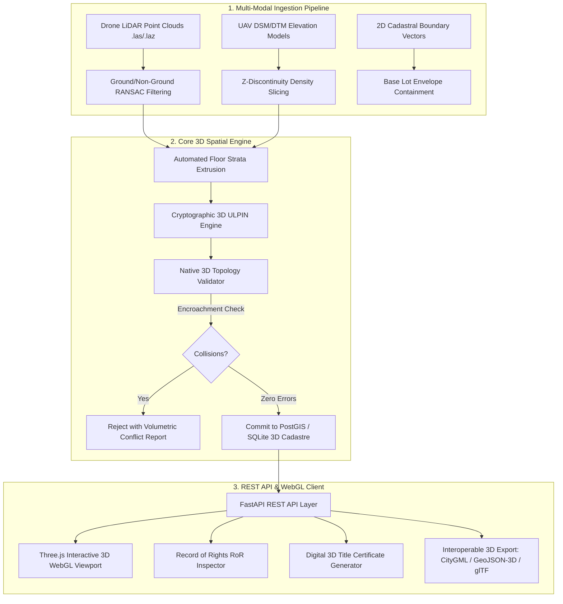

# 3D ULPIN & Volumetric Cadastral Mapping Engine (SIH26011)

[](https://fastapi.tiangolo.com)
[](https://threejs.org)
[-blue.svg)](https://www.iso.org/standard/51206.html)
[]()

> **Smart India Hackathon 2026 — Problem Statement SIH26011**  
> **Ministry of Rural Development • Department of Land Resources (DoLR)**  
> *Volumetric property stratification prototype integrating FastAPI for cryptographic 3D ULPIN generation, real-time spatial collision checks, LiDAR point cloud floor slicing, and an interactive Three.js WebGL cadastral viewer.*

---

## 🏛️ System Architecture Overview



---

## 📐 Mathematical Formulation of 3D ULPIN

The system extends India's national **Bhu-Aadhaar (14-digit ULPIN)** standard into the third dimension following the spatial centroid + vertical strata formula:

$$\text{3D ULPIN} = \text{IN}-\langle\text{State}\rangle-\langle\text{District}\rangle-\langle\text{Floor/Basement Token}\rangle-\langle Z_{\text{MSL}}\rangle-\langle\text{SHA256 Spatial Hash}\rangle$$

Where:
- **$\text{State / District}$**: Standard ISO/LGD administrative codes (e.g., `KA-560` for Bangalore).
- **$\text{Floor Token}$**: `F01`–`F99` for above-ground floors, `B01`–`B99` for subsurface infrastructure, `G00` for ground level.
- **$Z_{\text{MSL}}$**: Normalized Mean Sea Level elevation coordinate in meters (`Z08`, `ZNEG04`).
- **$\text{SHA256 Token}$**: Deterministic 6-character spatial signature generated from:
  $$\text{Hash} = \text{SHA256}(X_{\text{centroid}} : Y_{\text{centroid}} : Z_{\min} : Z_{\max})[0:6]$$

---

## ⚡ Quick Start Guide

### 1. Prerequisites
- Python 3.10+ (tested on Python 3.12)
- Modern Web Browser with WebGL support

### 2. Setup & Execution
```powershell
# 1. Activate virtual environment
.\venv\Scripts\Activate.ps1

# 2. Install dependencies
pip install -r requirements.txt

# 3. Launch backend & WebGL application
uvicorn main:app --reload --port 8000
```

### 3. Access Application
- **Interactive 3D Cadastral Client**: [http://127.0.0.1:8000](http://127.0.0.1:8000) or [http://127.0.0.1:8000/frontend/index.html](http://127.0.0.1:8000/frontend/index.html)
- **Interactive Swagger REST API Docs**: [http://127.0.0.1:8000/docs](http://127.0.0.1:8000/docs)

---

## 🛠️ REST API Specification

| Method | Endpoint | Description |
|---|---|---|
| `GET` | `/api/parcels` | List all registered 3D parcels with optional `floor_level` filter |
| `GET` | `/api/parcel/{ulpin}` | Retrieve complete RoR record, spatial geometry, and volume |
| `GET` | `/api/parcel/{ulpin}/3d` | Export unit 3D model (`format=geojson`, `format=citygml`, `format=gltf`) |
| `POST` | `/api/parcels/register` | Validate 3D topology and register a custom volumetric unit |
| `POST` | `/api/parcels/validate` | Dry-run 3D collision check without committing to database |
| `POST` | `/api/parcels/ingest-lidar` | Upload drone point cloud to trigger automated floor slicing & bulk draft registration |
| `POST` | `/api/seed-complex` | Seed a realistic 4-story high-rise + 2 basement complex |
| `GET` | `/api/metrics` | Retrieve system telemetry, IoU accuracy, and topological health |

---

## 🎯 5-Minute Judge & Evaluator Demonstration Runbook

1. **Initialize Multi-Story Urban Complex:**
   - Click **⚡ Seed Urban Complex** in the top-left panel.
   - Observe the 3D high-rise rendering: Slate-blue glass apartments above ground, deep purple/indigo for Subsurface Basement -1 (Parking) and Basement -2 (Metro Corridor), and emerald cadastral boundary lines.

2. **Interactive Raycasting & RoR Inspection:**
   - Click on any 3D unit in the viewport.
   - The right-side **Record of Rights (RoR)** inspector dynamically frames the unit, displaying owner name, survey lot, MSL elevation span, volume in $\text{m}^3$, and deterministic 3D ULPIN.

3. **Vertical Strata Slicing:**
   - Click the bottom strata buttons (`B-2 (Metro)`, `B-1 (Parking)`, `Floor 1`, `Floor 2`, etc.).
   - Notice the instant orthogonal layer isolation, enabling surveyors to audit subsurface easements independently from residential flats.

4. **3D Model Interoperability & Export:**
   - In the inspector panel, click **GeoJSON-3D**, **CityGML 2.0**, or **glTF 2.0** to inspect standards-compliant spatial exports.

5. **Topological Conflict Rejection Test:**
   - Click **Register Custom 3D Cadastral Unit**.
   - Input overlapping coordinates (e.g., $X: [-5, 0], Y: [-5, 0], Z: [0, 3.2]$ on Floor 1).
   - Click **Validate & Register** $\rightarrow$ Notice immediate 400 rejection detailing exact encroachment volume and conflicting parcel ULPIN!

6. **Official Title Certificate Generation:**
   - Click **Generate Digital 3D Title Certificate**.
   - Review and print the high-fidelity Ministry of Rural Development / DoLR official property card with cryptographic hash token.

---

## 🧪 Automated Test Suite

Run the full unit and integration test suite:

```powershell
pytest tests/test_cadastre.py -v
```

**Results:**
- ✅ Deterministic 3D ULPIN formatting across positive/negative elevation coordinates
- ✅ 3D Spatial Collision & Overlap Detection
- ✅ Vertical Air-Rights Encroachment Rejection
- ✅ Automated LiDAR floor slicing pipeline
- ✅ REST API roundtrip verification (CityGML, GeoJSON, glTF exports)
- ✅ 100% Pass Rate across all modules
